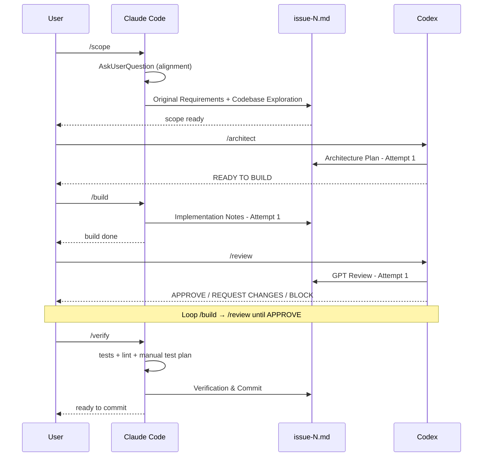

# claude-codex-hybrid-kit

Dual-model (Claude Code + Codex) hybrid workflow kit for shipping features
with structured scoping, architecture review, and acceptance gates.

`/scope → /architect → /build → /review → /verify`

---

## What this is

A drop-in workflow kit that ships three implementation modes for Claude
Code and a small set of templates for the project files Codex needs to
review against:

| Mode                     | When to use                                                                                | Entry command         |
| ------------------------ | ------------------------------------------------------------------------------------------ | --------------------- |
| **Hybrid** (recommended) | Production work, high-stakes features, anything where a single-model blind spot would hurt | `/scope #N`           |
| **Phased**               | Implementations large enough to compact context inside a single session                    | `/implement-phase #N` |
| **Non-phased**           | Small/medium changes that fit comfortably in one Claude Code session                       | `/implement`          |

The hybrid mode is the headline. Two models (Claude Code and Codex) split
the work — Claude scopes and builds, Codex architects and reviews — so
neither one can rubber-stamp its own tests or skip a hard design call.
Token usage spreads across providers; blind spots get caught.

The phased and non-phased modes are kept for continuity with how the
workflow evolved; they're useful for different size/complexity points.
Pick the one that matches the change in front of you.

## The hybrid setup



Why dual-model:

- **Tests written by the same model that scores them is a half-truth-but-real
  failure mode.** Single-model workflows tend to write tests that confirm
  the implementation rather than the requirement. Switching models between
  build and review breaks that.
- **Two models catch each other's blind spots.** Architecture decisions
  reviewed by the same model that made them get less scrutiny than they
  should.
- **Token usage spreads across providers**, which matters at volume.

## Two HITL points

The pipeline only needs human attention at two places:

1. **`/scope`** — Claude invokes `AskUserQuestion` extensively to align on
   product intent, UX preferences, scope boundaries, and acceptance criteria.
   Cheaper to clarify here than to rework after `/architect` or `/build`.
2. **`/verify`** — Claude generates a manual test plan from acceptance
   criteria, runs the automated test suite, and reports back. The user
   walks through the manual plan in a browser, signs off, and commits.

Everything else (architect → build → review loop until Codex stamps
APPROVE) runs without human intervention beyond switching models in the IDE.

## What's included

```
.claude/                            # Drop into ~/.claude/
  ├── commands/                     # 14 sanitized slash commands
  │   ├── implement.md              # Non-phased orchestrator entry
  │   ├── implement-phase.md        # Phased mode entry
  │   ├── critic-phase.md
  │   ├── security-phase.md
  │   ├── test-phase.md
  │   ├── commit-phase.md
  │   ├── commit.md                 # Non-phased final commit
  │   ├── catchup.md                # Show workflow state for an issue
  │   ├── scope.md                  # Hybrid Phase 1 (Claude)
  │   ├── build.md                  # Hybrid Phase 3 (Claude)
  │   ├── verify.md                 # Hybrid Phase 5 (Claude)
  │   ├── update-claude.md          # Keep CLAUDE.md in sync with code
  │   ├── bmad-start.md             # Greenfield inception (BMAD-style)
  │   └── bmad-synthesize.md        # BMAD → standard project docs
  ├── agents/                       # 5 sanitized agent role files
  │   ├── 00-orchestrator-agent.md
  │   ├── 01-implementation-agent.md
  │   ├── 02-critic-agent.md
  │   ├── 03-security-agent.md
  │   └── 04-testing-agent.md
  └── WORKFLOW.md                   # Master workflow doc

shared-docs/                        # Place at parent of your projects
  ├── GPT_ARCHITECT_REVIEW_STANDARD.md   # Canonical /architect & /review contract
  └── PROJECT_DOCUMENTATION_STANDARD.md  # 4-doc project structure spec

templates/                          # Copy into each project
  ├── CLAUDE.md.template            # Project quick reference
  ├── AGENTS.md.template            # Codex hybrid guide (overlay-only)
  ├── docs/
  │   ├── context/ProjectName.md.template   # Manifest scaffold
  │   └── business-plan.md.template
  ├── constraint-doc.md.template
  └── implementations/.gitkeep

docs/                               # Read here for deeper detail
  ├── journey.md                    # The 5-month story behind this kit
  ├── workflows/
  │   ├── 1-non-phased.md
  │   ├── 2-phased.md
  │   └── 3-hybrid.md
  ├── checkpoints.md                # The 2 HITL points explained
  └── diagrams/

MANUAL-SESSION-CHECKLIST.md         # Step-by-step phase-mode checklist
INSTALL.md                          # Setup instructions
```

The `GPT_ARCHITECT_REVIEW_STANDARD.md` defines the universal `/architect`
and `/review` contract — output templates, attempt numbering, REQ-XX
traceability, OWASP/STRIDE checks, AI-bias observations, append-only
handover rules. It's designed for **partial reads**: Codex loads only
`## /architect` + `## Handover Contract` when running `/architect`, and
only `## /review` + `## Handover Contract` when running `/review`. That
keeps token usage close to the old single-file project guides.

Each project's `AGENTS.md` is small (~120 lines) and overlays only
project-specific context, constraints, and checks on top of the shared
contract.

## Companion tools

These are not bundled. Install them separately if useful:

- **BMAD** (Breakthrough Method for AI-Driven Development) — 3-phase
  greenfield inception (Analyst → PM → Architect). The `/bmad-start`
  and `/bmad-synthesize` commands in `.claude/commands/` wrap it. Run
  once at project inception to generate `_bmad-output/{product-brief,
prd, architecture}.md` and synthesize them into the standard project
  docs (CLAUDE.md, manifest, AGENTS.md, business plan). See
  https://github.com/bmadcode/BMAD-METHOD for the upstream.
- **superpowers** — Claude Code plugin with curated skills (output
  styles, brainstorming patterns, debugging recipes). Cherry-pick
  rather than installing wholesale: most of its value is the
  patterns, not the installer.
  https://github.com/obra/superpowers
- **RTK** (Rust Token Killer) — token-optimizing CLI proxy that
  rewrites common dev commands transparently. 60–90% savings on read-
  only operations. https://github.com/jurgenwerk/rtk
- **caveman** — output style that strips filler, articles, and
  pleasantries from chat without touching technical substance.
  Roughly 75% token reduction on conversational output. Compatible
  with this kit's "documentation = no caveman" rule (workflow output
  stays in normal prose). https://github.com/disler/caveman-mode

## Quickstart

```bash
# 1. Clone
git clone https://github.com/{your-handle}/claude-codex-hybrid-kit.git
cd claude-codex-hybrid-kit

# 2. Drop slash commands and agents into your global Claude Code config
cp -r .claude/commands ~/.claude/
cp -r .claude/agents   ~/.claude/
cp    .claude/WORKFLOW.md ~/.claude/

# 3. Place the shared docs at the parent of your projects (mirrors the
#    layout in this kit). Adjust the relative path in your project's
#    AGENTS.md if you put them elsewhere.
mkdir -p ../docs
cp shared-docs/*.md ../docs/

# 4. In each project, install the templates and customize
cp templates/CLAUDE.md.template     <project>/CLAUDE.md
cp templates/AGENTS.md.template     <project>/AGENTS.md
mkdir -p <project>/docs/context
cp templates/docs/context/ProjectName.md.template  <project>/docs/context/<ProjectName>.md
cp templates/docs/business-plan.md.template        <project>/docs/business-plan.md
mkdir -p <project>/.claude/implementations/archive
# Then fill in every {placeholder} in the four files above.
```

After that, in your project: `/scope` (in Claude Code) → `/architect`
(in Codex) → `/build` (Claude) → `/review` (Codex) → `/verify` (Claude).

Full setup walkthrough in [INSTALL.md](INSTALL.md).

## Deeper docs

- **The 5-month story** behind this kit — how the workflow evolved from
  native plan mode through phased to hybrid: [docs/journey.md](docs/journey.md)
- **Workflow walkthroughs** — when to use each mode and what each phase
  actually does: [docs/workflows/](docs/workflows/)
- **The two HITL points** explained in detail: [docs/checkpoints.md](docs/checkpoints.md)
- **Phase mode step-by-step** for multi-session implementations:
  [MANUAL-SESSION-CHECKLIST.md](MANUAL-SESSION-CHECKLIST.md)

## Status

This is a snapshot of one practitioner's working setup. It's been used
daily on production projects for ~5 months at the time of release. Issues
and PRs welcome but expect slow turnaround — primary maintainer is a solo
developer.

## License

MIT — see [LICENSE](LICENSE).
